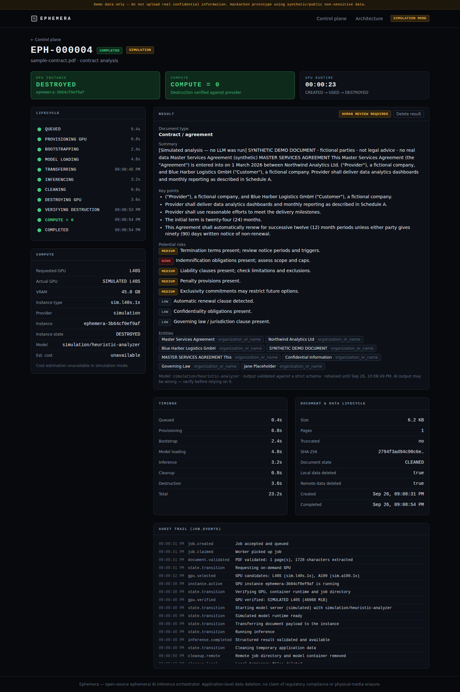
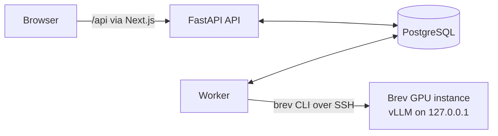

# Ephemera

**AI inference that disappears when the job is done.**
Provision. Infer. Destroy.

Ephemera is an open-source **ephemeral AI inference orchestrator**. For each job it
provisions a GPU on demand through **NVIDIA Brev**, starts an open-weight LLM with
**vLLM** in an isolated environment, analyses a document, returns a structured result,
deletes temporary application data, **destroys the GPU instance and verifies it is gone**.
The whole lifecycle is persisted and visible.

```
PROVISION → BOOTSTRAP → LOAD MODEL → TRANSFER → INFER → CLEAN → DESTROY → VERIFY → COMPUTE = 0
```

> Hackathon prototype. Use synthetic or public, non-sensitive documents only.
> Ephemera deletes application-level temporary data and destroys compute; it makes no
> claim of absolute security, regulatory compliance or physical-media erasure.

## Problem

Teams want to run LLMs on sensitive documents without sending them to a third-party
model API — and without keeping a GPU (and everything on its disk) running around the
clock for workloads that arrive a few times a day.

## Solution: Compute-to-Zero

* **No idle GPU.** Compute exists only for the workload. Between jobs the dashboard
  shows **0 GPU instances**, and that zero is confirmed against the provider's own
  instance listing, not just Ephemera's database.
* **Destroy on every path.** If provisioning was attempted, Ephemera attempts destruction
  and verifies it — on success, model failure, inference failure, timeout, user
  cancellation and worker shutdown. Crashed workers are reconciled on restart. An
  unverified destruction is shown as `CLEANUP_FAILED` and blocks new GPUs.
* **Auditable.** Every state transition is a timestamped `job_events` row. Document
  text, prompts and credentials never reach logs or the database.



## Architecture



API accepts jobs (HTTP 202) → worker claims them from PostgreSQL → orchestrator drives
the state machine through ports (`ComputeProvider`, `InferenceProvider`, …) implemented by
the Brev and vLLM adapters (or simulators). Details: [docs/architecture.md](docs/architecture.md).

## Tech stack

| Layer | Choice |
|---|---|
| API / worker | Python 3.12, FastAPI, Pydantic v2, SQLAlchemy 2 (async) + asyncpg, Alembic |
| Database | PostgreSQL 16 (also the durable job queue — no Redis/Celery/Kafka) |
| GPU | NVIDIA Brev (CLI v0.6.335), L40S preferred, configurable fallbacks |
| Inference | vLLM `v0.30.0` (`-cu129` image) (OpenAI-compatible, JSON-schema output); NIM-ready port |
| Model | Configurable `MODEL_ID`, default `meta-llama/Llama-3.1-8B-Instruct` (open-weight, gated) |
| Documents | PyMuPDF in a resource-limited subprocess |
| Frontend | Next.js 16, React 19, TypeScript, Tailwind CSS 4 |
| Tests | pytest, pytest-asyncio, HTTPX, Playwright |
| Ops | Docker, Docker Compose, GitHub Actions |

## Quick start (simulation — no GPU, no credentials)

```bash
cp .env.example .env
make up                    # postgres, migrations, api, worker, web
open http://localhost:3000
```

Upload `examples/demo-documents/sample-contract.pdf` and watch the lifecycle. Tick
*Inject inference failure* to see the GPU destroyed after a failure.

**Simulation mode** runs the real orchestrator, state machine, database and UI with a
simulated compute provider and a heuristic analyser. It is labelled **SIMULATION MODE**
on every screen and simulated summaries start with "[Simulated analysis — no LLM was run]".
It never presents simulated provisioning as real.

### Without Docker

PostgreSQL on `localhost:5432` (user/password/db `ephemera`), then:

```bash
make install migrate
make api      # :8000  (OpenAPI at /docs)
make worker
make web      # :3000
```

## Real Brev mode

Set in `.env`: `EPHEMERA_MODE=real`, `BREV_API_KEY`, optionally `BREV_ORG`, and
`HF_TOKEN` (accept the Llama licence on Hugging Face first). Then `make up`. The worker
refuses to start in real mode without credentials and says why.

> **Validation status:** the real-mode code path is tested end-to-end against a fake
> `brev` CLI that mirrors v0.6.335's syntax and JSON output, and the GPU bootstrap
> script is tested with stubbed `nvidia-smi`/`docker`/`curl`. **Real Brev validation is
> pending credentials** — it has not yet been run on real GPUs. Run
> `scripts/real_smoke_test.py --yes` first. See [docs/deployment.md](docs/deployment.md).

## Environment variables

All configuration is environment-driven (Pydantic Settings); see
[`.env.example`](.env.example). Key ones:

| Variable | Default | Purpose |
|---|---|---|
| `EPHEMERA_MODE` | `simulation` | `simulation` or `real` |
| `BREV_API_KEY` / `BREV_ORG` | — | Brev credentials (real mode) |
| `MODEL_ID` / `HF_TOKEN` | Llama-3.1-8B-Instruct / — | Model and gated-download token |
| `GPU_PREFERENCE` / `GPU_MIN_VRAM_GB` / `GPU_FALLBACK_TYPES` | `L40S` / `40` / `L40,A6000,RTX6000,A100` | GPU selection |
| `BREV_INSTANCE_TYPES` | — | Pin exact Brev instance types instead of searching |
| `MAX_ACTIVE_JOBS` / `MAX_GPU_INSTANCES` | `1` / `1` | Cost safety |
| `MAX_JOB_RUNTIME_SECONDS` / `MAX_PROVISIONING_SECONDS` | `1800` / `600` | Timeouts |
| `MAX_DOCUMENT_SIZE_MB` / `MAX_DOCUMENT_PAGES` | `25` / `100` | Input limits |
| `RESULT_RETENTION_SECONDS` | `3600` | How long the validated analysis is kept |
| `DEMO_FORCE_INFERENCE_FAILURE` | `false` | Fail every job at inference (demo) |

## GPU requirements

An 8B-class model needs ~16 GB for bf16 weights plus KV cache; the defaults ask for a
single GPU with ≥ 40 GB VRAM and compute capability ≥ 8.0, preferring **L40S (48 GB)**.
Candidates come from `brev search gpu --json`; nothing is hard-coded. The job page shows
requested GPU, actual instance type, the GPU reported by `nvidia-smi`, VRAM and
provisioning time.

## Security model

* Document = untrusted data: never in the system prompt, delimited by a random boundary,
  control tokens neutralised; output schema-validated; **the model has no tools**.
* The model server listens on the instance's `127.0.0.1` only; requests run over Brev
  SSH. The browser can only reach the Next.js origin.
* Brev commands are fixed argument vectors (no shell), limited to `ephemera-<12 hex>`
  names; filenames never reach a path or CLI.
* Secrets only in env vars; redacted from logs; not passed to the Brev CLI beyond its own
  key; `HF_TOKEN` travels as a 0600 file, never a command line.
* PDFs parsed in a CPU/memory-limited subprocess before any GPU exists.
* Single-user demo: **no authentication** yet — keep it on localhost.

Full analysis of T1–T12 with residual risks: [docs/threat-model.md](docs/threat-model.md).

## Tests

```bash
make test        # 146 backend tests (unit + PostgreSQL integration)
make lint typecheck
make up && make e2e   # Playwright: success, forced failure, prompt injection
```

Includes the ten critical tests: successful job destroys GPU; provisioning failure
(even after partial creation) leaves no orphan; model startup failure destroys; inference
failure cleans + destroys; cleanup/destroy failure → `CLEANUP_FAILED`; worker restart is
reconciled; oversized document rejected before provisioning; concurrency limit keeps the
second job queued; prompt injection treated as data; secrets never logged. Plus timeout,
user cancellation, SIGTERM mid-job and database outage during teardown.

## Demo

Step-by-step presenter script: [docs/demo.md](docs/demo.md).

## Limitations

* Real Brev + vLLM path not yet exercised on real GPUs (see above).
* No authentication or multi-tenancy; single demo owner.
* PDF only, text layer only (no OCR); long documents are truncated to
  `MAX_INPUT_CHARS` (flagged in the UI and forcing human review), no chunking yet.
* First real run downloads the model onto a fresh instance; cold starts take minutes.
* Deletion is application-level; the cloud provider's storage lifecycle is outside
  Ephemera's control.
* The analysis result is kept in PostgreSQL for `RESULT_RETENTION_SECONDS`.
* Cost shown is an estimate (listed hourly price × runtime) and only when Brev reports a price.

## Roadmap

1. Real-infrastructure validation and recorded timings (`scripts/real_smoke_test.py`).
2. NVIDIA NIM provider behind `InferenceProvider`.
3. Authentication and per-tenant ownership (the ownership check already exists).
4. Chunked / map-reduce analysis for long documents; OCR.
5. Stronger PDF parser isolation (separate container, seccomp).
6. Warm-pool option with explicit TTL for latency-sensitive use (opt-in, documented as
   weakening compute-to-zero).
7. Server-Sent Events instead of polling; Prometheus metrics.

## Repository layout

```
apps/api/        FastAPI API, worker, orchestrator, adapters, Alembic, tests
apps/web/        Next.js control plane + Playwright E2E
infra/gpu/       bootstrap.sh executed on the ephemeral GPU instance
infra/docker/    Dockerfiles; infra/docker-compose.yml
docs/            architecture, threat model, demo, deployment, ADRs, implementation plan
examples/        synthetic demo PDFs
scripts/         demo-document generator, real smoke test
```

## License

Apache-2.0 — see [LICENSE](LICENSE).
