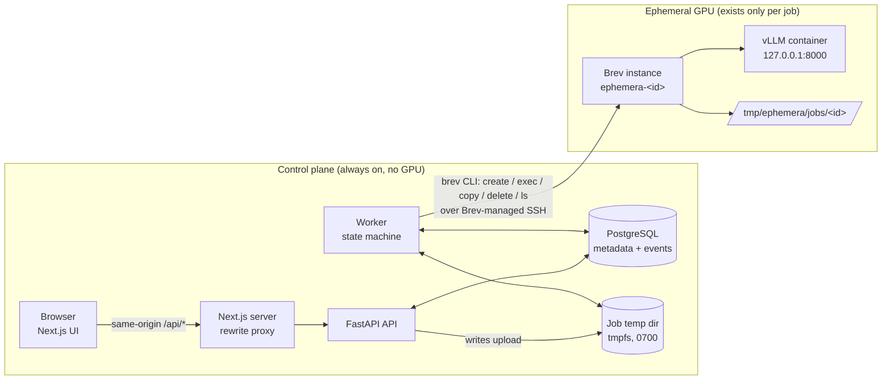
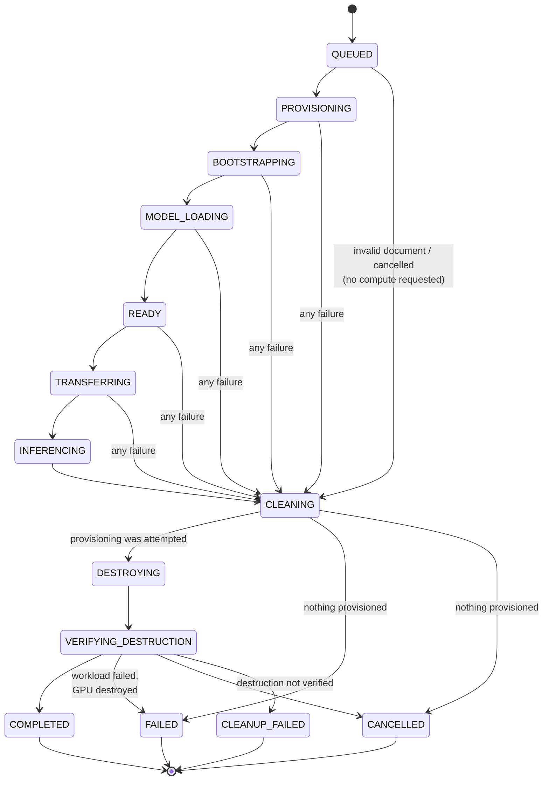
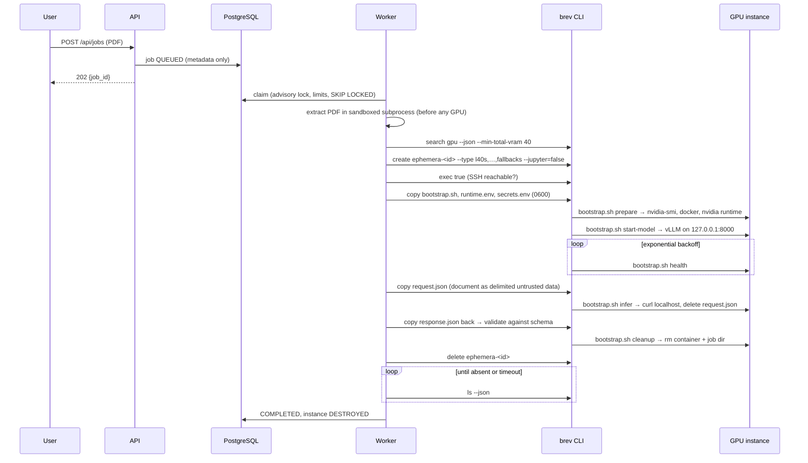

# Architecture

Ephemera is a **compute lifecycle orchestrator**. The product is the lifecycle —
provision, infer, clean, destroy, verify — not the chat or the document UI.

## Components



| Component | Responsibility | Never does |
|---|---|---|
| **Web** (`apps/web`) | Upload, live lifecycle view, results | Talk to a GPU or model server |
| **API** (`apps/api/app/api`) | Validate uploads, create jobs (HTTP 202), serve state/events/stats | Block on GPU work; call Brev |
| **Worker** (`apps/api/app/workers`) | Claim jobs, run the orchestrator, heartbeat, reconcile | Hold more than one job; exceed limits |
| **Orchestrator** (`app/application/orchestrator.py`) | The lifecycle and its teardown invariant | Depend on Brev/vLLM specifics (ports only) |
| **Brev adapter** (`app/infrastructure/brev`) | The *only* code that invokes the `brev` CLI | Touch instances outside `ephemera-<12 hex>` |
| **vLLM provider** (`app/infrastructure/inference/vllm.py`) + `infra/gpu/bootstrap.sh` | Environment checks, model server, inference, remote cleanup | Expose the model port beyond localhost |

## Hexagonal layout

```
app/domain/          pure: JobStatus state machine, value objects, error codes, ports (Protocols)
app/application/     use cases: orchestrator, reconciliation, prompts, result parsing, GPU ranking
app/infrastructure/  adapters: brev/, compute/simulated, inference/{vllm,simulated,nim}, database/, documents/, storage/
app/api/, app/workers/  presentation / process entry points
app/core/            settings, logging, composition root (container.py)
```

Ports (`app/domain/ports.py`): `ComputeProvider`, `InferenceProvider`, `RemoteExecutor`,
`DocumentProcessor`, `JobRepository`, `EventRepository`. Swapping Brev for another
provider, or vLLM for NIM, means writing one adapter; the orchestrator does not change.

## Job state machine



Rules enforced in `app/domain/status.py` and tested in `tests/unit/test_state_machine.py`:

* No compute-phase state can reach a terminal state directly.
* `COMPLETED` is only reachable from `VERIFYING_DESTRUCTION`.
* Every transition is validated under a row lock and written with a `job_events` row
  (`state.transition`, timestamp, from/to, metadata) in the same transaction.
* `update_fields()` cannot change `status`; only `transition()` can.

## The critical invariant

> If a job attempts to provision a GPU, Ephemera attempts to destroy that instance and
> verify its absence no matter how the job ends.

```python
execute = create_task(_execute(run))          # happy path
try:
    await wait_for(shield(execute), MAX_JOB_RUNTIME_SECONDS)
except (timeout | user cancel | worker SIGTERM | any error):
    record the root cause
finally:
    await _shielded_teardown(run)             # cannot be cancelled by a 2nd signal
```

Details that make it hold in practice:

* `instance_state=PROVISIONING` is persisted **before** `brev create` is called, and
  `run.provision_attempted` is set, so a failed or timed-out create (which can still
  leave a VM) is destroyed too.
* Teardown steps are individually best-effort: a database outage while recording
  `CLEANING` does not skip `brev delete` (`test_database_outage_during_teardown_does_not_skip_destroy`).
* Destroy is retried; success is decided by **verification** (`brev ls` no longer lists
  the instance), not by the delete call's exit code.
* If verification fails, the job ends `CLEANUP_FAILED` with `instance_state=DESTROY_FAILED`.
  That job keeps counting against `MAX_GPU_INSTANCES`, so a leak **blocks new
  provisioning** until reconciliation destroys it.

What the in-process `finally` cannot cover (SIGKILL, host loss) is covered by
[reconciliation](#reconciliation).

## Execution flow (real mode)



### Remote command protocol

`bootstrap.sh` sub-commands are a fixed set (`prepare`, `start-model`, `health`, `infer`,
`cleanup`) invoked with a UUID-derived path — never user data. Every handled outcome
**exits 0** and prints `EPHEMERA_RESULT=ok` or `EPHEMERA_RESULT=error:<reason>:<message>`.
A non-zero exit means only "transport failed". This is deliberate: `brev exec` (v0.6.335)
treats any non-zero exit as an SSH failure, refreshes its SSH config and **re-runs the
command** — which would duplicate health polls and inference. Sub-commands are also
idempotent in case a genuine transport retry happens.

## GPU selection

`app/application/gpu_selection.py` ranks the provider's live catalogue:

1. `BREV_INSTANCE_TYPES` (explicit override, tried in order), else
2. offers matching `GPU_PREFERENCE` (default `L40S`), cheapest first, then
3. `GPU_FALLBACK_TYPES` in configured order, then
4. any other eligible offer.

Eligible = single GPU, total VRAM ≥ `GPU_MIN_VRAM_GB`, compute capability ≥
`GPU_MIN_COMPUTE_CAPABILITY`. GPU names match on exact tokens (`L40` never matches
`L40S`). The top `GPU_MAX_CANDIDATES` types are passed to `brev create --type a,b,c`,
which falls back through them. The UI shows requested GPU, the actual instance type,
the GPU reported by `nvidia-smi`, VRAM, provider and provisioning time.

## Reconciliation

Runs at worker start-up, every `RECONCILE_INTERVAL_SECONDS`, and after every job:

| Case | Action |
|---|---|
| Job claimed by *this* `WORKER_ID` in a previous process, or any claimed job with a heartbeat older than `STALE_JOB_SECONDS` | Claimed-but-unstarted → re-queue. Otherwise local cleanup, destroy + verify if provisioning was attempted, then `FAILED (WORKER_INTERRUPTED)` or `CLEANUP_FAILED` |
| Terminal job with an unverified instance | Retry destroy + verify |
| `ephemera-*` instance whose job is terminal | Destroy + verify |
| `ephemera-*` instance unknown to this database | Report only (another deployment may own it) unless `RECONCILE_DELETE_UNKNOWN_INSTANCES=true` |
| Any non-`ephemera-<12 hex>` instance | Never touched |

The worker also records the provider's own `ephemera-*` instance list in
`worker_heartbeats.observed_instances`. `/api/stats` exposes
`compute_to_zero_verified_by_provider`: **true only if the database says no instance is
active and the provider's latest listing agrees**. That is what the dashboard's
"COMPUTE = 0" is based on.

## Data lifecycle

| Data | Where | Lifetime |
|---|---|---|
| Uploaded PDF | `DATA_DIR/<job-uuid>/document.pdf` (0600; tmpfs in Compose) | Deleted in teardown on every path |
| Extracted text | Worker memory; transient file removed immediately after extraction | Job duration |
| Request payload (contains text) | Local temp file (deleted after upload) → instance `request.json` (deleted right after the HTTP call) | Seconds |
| `HF_TOKEN` | 0600 file on the instance, deleted once the container starts; env of the vLLM container | Until instance destruction |
| Raw model output | Local temp file, deleted after parsing | Seconds |
| Validated analysis | `job_results` (JSONB) with `expires_at` | `RESULT_RETENTION_SECONDS` (default 1 h), purged by the worker; deletable via API/UI |
| Metadata (filename, size, sha256, timings, GPU, errors) | `jobs`, `job_events` | Persistent |

Document states: `RECEIVED → PROCESSING → TRANSFERRED → PROCESSED → CLEANED` (or `FAILED`).
Deletion is **application-level** (unlink / `rm -rf` / instance deletion); Ephemera makes
no claim about physical-media remanence at the cloud provider.

## Limits and timeouts

Every external operation has a timeout (see `.env.example`): provisioning, SSH
readiness, bootstrap, model readiness, transfer, inference, cleanup, deletion,
deletion verification, PDF extraction, and the whole job (`MAX_JOB_RUNTIME_SECONDS`;
teardown runs after it and is not cut short by it). Readiness loops use exponential
backoff. On timeout the `brev` process group is killed (`start_new_session` + `killpg`).
Capacity: `MAX_ACTIVE_JOBS`, `MAX_GPU_INSTANCES` (checked atomically at claim time under a
PostgreSQL advisory lock), `MAX_QUEUED_JOBS` (HTTP 429), `MAX_DOCUMENT_SIZE_MB` (HTTP 413,
enforced while streaming), `MAX_DOCUMENT_PAGES`, `MAX_INPUT_CHARS`.

## Modes

| | `simulation` | `real` |
|---|---|---|
| Compute | `SimulatedComputeProvider` (in-memory, realistic delays) | `BrevComputeProvider` |
| Inference | Heuristic analyser, labelled `simulation/heuristic-analyzer`; summaries start with "[Simulated analysis — no LLM was run]" | `VLLMProvider` |
| UI | Amber "SIMULATION MODE" badge on every page and job | "Real mode · Brev" |
| Credentials | None | `BREV_API_KEY` required (worker refuses to start otherwise) |

Both modes run the same orchestrator, state machine, persistence and API.
